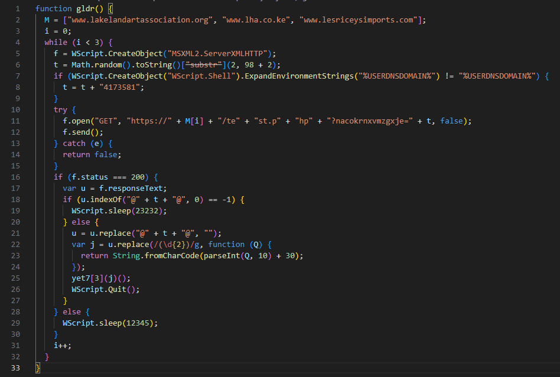

# GootLoader JS Unpacker and C2 Extractor

## Why

This was a project to learn AST manipulation with babel and JavaScript.

So it is likely that this is not the best code because I am a JavaScript noob.

The script is static, it does not execute any of the manipulated code.

## Usage

`node.exe gootloader_decoder.js -f <sample>`

This will unpack the Gootloader script layers to _transpiled.layer\<nr\>.js_. After that it will attempt to find C2 data. Even if some of it fails, it should serve in saving some unpacking steps.

The very first transpiled layer is the extraction of just the relevant functions which are often buried in > 6000 lines of code. This step allows manual analysis of the initial code, e.g., in case of debugging the script but also to see how the layer works.

Starting from the second layer the unpacker will determine the responsible decrypt function, the key and a decoding constant which is changed in every sample.

It will attempt to extract C2's at the last layer, which it currently assumes to be either the third or the 6th (as these are the samples I got).

Note: Some of the layers will be wrapped into a function named _gldr()_. This function is **not** part of the malware but the decoder. It is necessary where gootloader dynamically wraps the unpacked code into an unnamed function. Since the body contains the a return, the AST can only be parsed with this wrapped function.

## Example Output

Decoded last layer with C2 data:

Output of unpacking and extraction:

